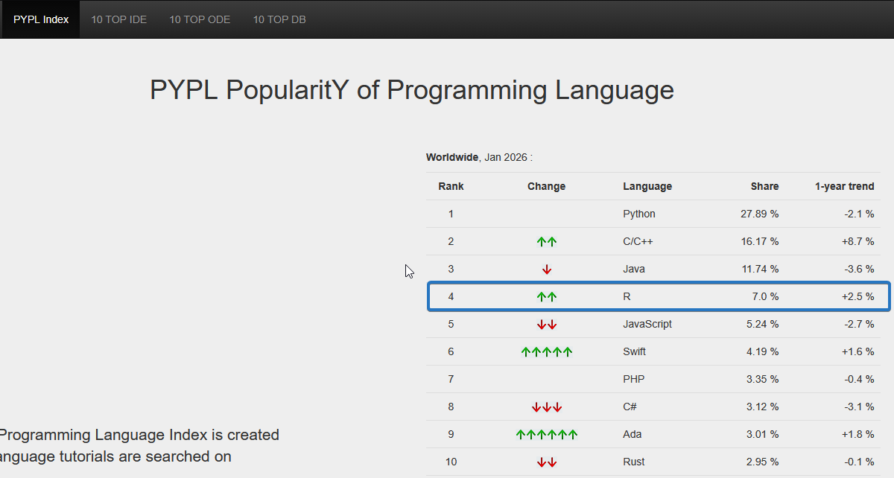

# The R language starts 2026 with strong momentum!

Whether in terms of available online content (TIOBE index) or web searches performed (PYPL index), R is making progress:

-   rising from 18th to 10th rank in terms of available content (TIOBE)

-   ranking in 4th position in search volume (PYPL)

In particular, the second point leads me to believe that the language dynamics are positive: while the available content may have a retrospective effect (unless the date of creation of the content is taken into account), the increase in search volume indicates an increase in usage and/or learning.

It should be noted that at the end of 2025, the [R Consortium](https://r-consortium.org/) announced that funds (\$650,000) had been allocated by the [Software Sustainability Institute](https://www.software.ac.uk/) to enable research into ‘the next generation of contributors to R’.

[LinkedIn post](https://www.linkedin.com/posts/r-consortium_rstats-opensource-researchsoftware-activity-7407471331916779522-YL-n)

In a context where the popularity of Python far exceeds all other options, it is often difficult to predict the future of other languages or even the relevance of investing time in developing skills.

One point in particular raises questions: if we zoom in on France, the share of Python search volume rises from 28% (global level) to 69%, which seems to reflect a (significant) over-focus in terms of technological choice. The tendency to follow trends (vs. pragmatic choices) undoubtedly plays a large part in this.

I have noticed that the students I mentor on the [OpenClassrooms Data Analyst](https://openclassrooms.com/en/paths/898-data-analyst) course consistently choose Python (which makes sense, given the high demand in the market).

Similarly, the share of research for R in France is 3.22% compared to 7% globally. However, this is accompanied by slightly higher growth (+2.8% in France vs. +2.5% globally).

Is this a new sign of a trend?\
If so, it would indicate significant growth potential for the use of R in France in 2026.

For my part, I continue to devote a large part of my time to developing an ecosystem around R because I believe in the relevance of this language for data analysis and the design of 100% open source applications and dashboards that can be deployed quickly.

Sources:

-   The PYPL Index <https://pypl.github.io/PYPL.html>

-   The TIODE Index [https://www.tiobe.com/tiobe-index](https://www.tiobe.com/tiobe-index/)

-   My own [post](https://www.linkedin.com/posts/philippeperet_r-tiobe-pypl-activity-7416775574913847297-cpV4?utm_source=share&utm_medium=member_desktop&rcm=ACoAADY7eAoBB5QBzJu9_JCaqCN9ZR959pQVWGA) on LinkedIn
