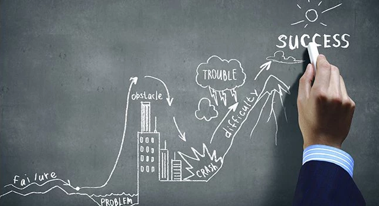

# Trade-offs are positive renunciations

Unmet goals are generally considered failures.

However, it is sometimes necessary, even beneficial, to give up a short-term goal in order to better achieve a more global long-term goal — the famous “take a step back to jump further.”

My goal was to deliver a v0.8.x-beta version of the {[kitems](https://github.com/thekangaroofactory/kitems)} package for end of March (2026-Q1) with the idea of taking an additional step towards stability/productivity.

The last few weeks have called this goal into question.

Since the end of 2025 (v0.7.2-beta delivery), I have been conducting a full-scale testing phase by migrating/transforming/creating applications based on this package and its various implementations that were introduced with v0.7.x minor version.

While the first osbervation is that the robustness of the architecture and solutions introduced has been confirmed, this new flexibility has also opened up new horizons (wrap all the module calls into a data manager component) that expand the range of possibilities and multiply the developments needed to achieve them.

As of now, there are about 70 tasks/issues open & candidates for a v.0.8.x version.\
And there is no way to complete them all in such a short time frame.

In the short term, it is wiser to aim for a v0.7.3 convergence revision to fix bugs that were discovered during the latest testing phase, and to consolidate the vision for a v0.8.x version and the path to wider availability.

My final observation is that this open-source work is rich in content, strategic thinking, and open questions, and goes far beyond development activity.\
Especially since we are now at a stage where any significant change will have an impact on all my apps.

*Note: part of this post (draft was in French) was translated with [DeepL.com](https://www.deepl.com) to save some time.*
