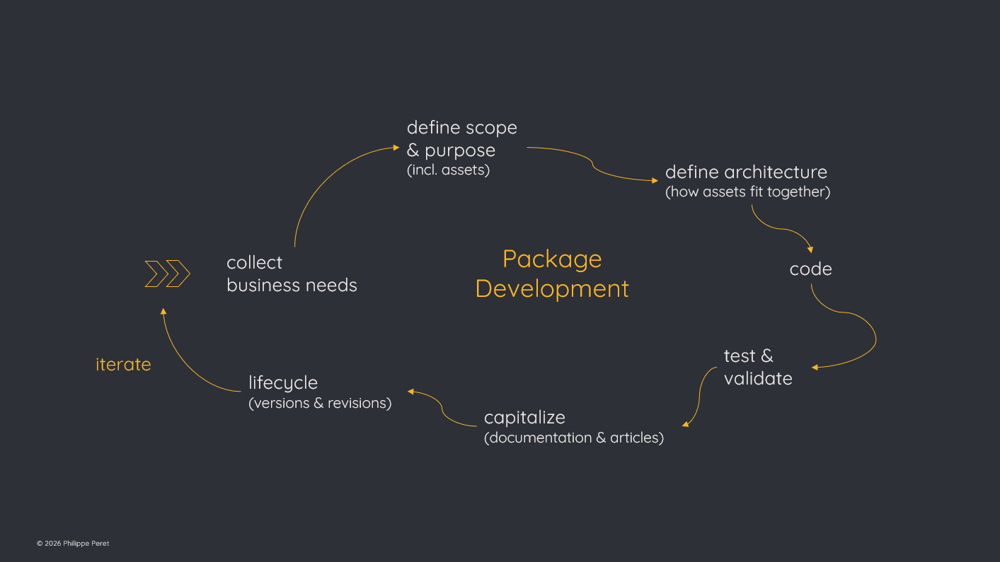

# Package Development is (Data) Project Management

Package development is (too) often seen as a say *pure* programming activity.

In a way it is accurate because we basically do coding and coding is done by developers or programmers. Also, sometimes packages are *just* a collection of functions that we use all the time, and wrapping them into a package saves time.

But in most cases, this assumption is quite superficial.\
Package development is an attempt to solve a specific issue for which there is not yet an obvious solution or tool.

Many of those issues are detected when working on other projects.\
For example, when no tool was available to monitor the error logs of a big data pipeline, and it was not among the priorities to have one so almost no resources were available to make such tool.\
In my mind, it raised the need to be able to develop tools with both limited scope & resources available but great ROI because solving daily pains. The development of such tool is considered too costly mostly because the basis takes a lot of time while the feature part can't be developed on its own.\
A package that would wrap the costly part would also enable those quick wins, hence save time and money.

These very few lines already introduced additional activities, like collecting business needs, design & scoping.

## A package is not a one-shot delivery

It's also project management because a package is not a one-shot delivery.

As we just saw, it comes with some business requirements (the challenge to be solved) that need to be collected and specified to define the scope of the package.

It also comes with priority management.\
Not everything can be done in a single day or week and in most cases month.\
Not only because it takes time to actually code the package, but also because it takes time to mature the best approach, knowing that it will be used in several – sometimes many – other projects.\
Those dependencies may turn a small technical debt into a much bigger problem if you didn't carefully converged your approach.

## A package is basically R&D

When we say package development, we should actually say package research & development.

The design part of how-do-I-solve-that-problem takes an exploration phase when one will do research around the technical issue – very often it will take a deep dive into why the issue even exists – to get options on how to address the problem.

Assessing both the issue and the options will end up in the definition of a governance for your package and serve as a basis for its architecture.

## Package development is Agile by nature

This R&D phase iterates over development and test / validation throughout the different phases of such project:

-   POC (Proof Of Concept) = demonstrate it will work

-   Convergence = actually develop the features

-   Deploy

As for any project's lifecycle, production will raise additional needs that fit with the scope.\
Hence looping over convergence & deploy.

## Code is data

The title states data project management because code is data, as well as other assets like notions, objects and even the scope itself.

It means you need to have a data governance with a set of rules to manage your project.\
For example, everything should stick to the scope.\
But also because the best practices are very strict when it comes to package development.\
(R for example has a check tool that will force you to reach a very high standard before you can submit your package to the community).

This leads to architecture which is a very critical part of package development.\
Architecture of the package itself since you can't just put everything in one folder as some object will be needed for the development or test but not released to the user.\
But also architecture of the assets of your package. Solving complex issues requires to slice them into smaller pieces easier to address (reason why I say it's Agile by nature). Without a careful study, functions may end up in what we call spaghetti-code that will create a technical debt in your applications up to a point where it may never be solved.

## Package development is 360°

Architecture itself leads to another critical aspect as you need to take care about the impacts of your project.\
The idiomatic impact is that it will (hopefully) solve the initial issue. But there are also other impacts, for example how it will modify the dependencies since most packages rely on other – deeper – packages.

And finally, the package development itself leads to many other mandatory activities like code governance (we call it version control) where you organize how the code is delivered, code release (building a ready-to-install package for the users), quality assessment (QA, automated & manual tests, test coverage), and of course capitalization as solving a specific issue requires the users to understand the issue itself as well as you solutions through exhaustive documentation & articles.

To sum up, I would propose the following checklist wrapping all those activities:

-   collect business need

-   define scope & purpose (incl. objects, notions)

-   define architecture (how functions fit together & covers the scope)

-   code

-   test & validate

-   capitalize (documentation & articles)

-   lifecycle (versions & revisions)

-   iterate

Which is pretty much what (data) project management is.
