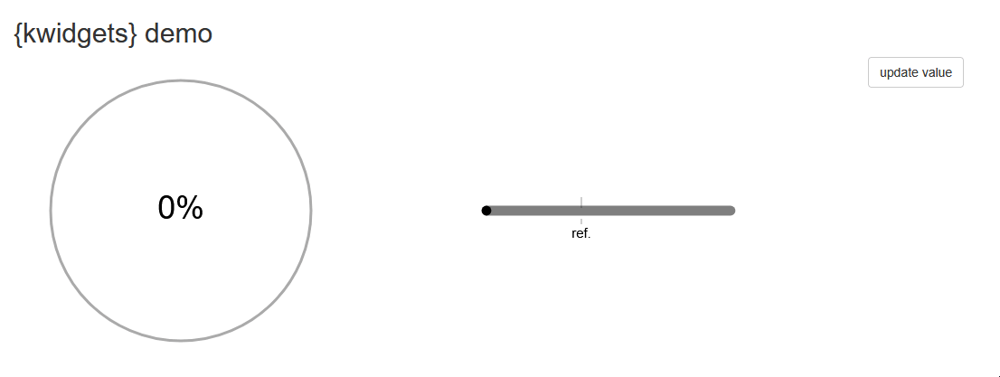

# Exploring the SVG path with R

Over the last few days, I have been exploring the use of SVG (Scalable Vector Graphics) to integrate widgets into my application interfaces.

## Motivations

As it is often the case, the origin of this exploration is an observation: I use a lot of visuals to show the performance/progress/measurement of a particular variable vs. a target or reference.

For some tasks, the HTML \<[progress](https://developer.mozilla.org/en-US/docs/Web/HTML/Reference/Elements/progress)\> object is perfectly suited and allows you to obtain the expected result with a single instruction.\
For example, to notify the progress of data loading.

But for other use cases, the goal is not only to display a value between two limits, but to enrich the indicator with its context: if 20% of the annual revenue target is achieved by the end of Q1, don't we want to be able to see at a glance not only the 20% achieved, but also how far behind we are in reaching the end-of-year target?

Like many, I have developed the (bad) habit of using graphics libraries to produce indicators that are not available in HTML. This tendency is accentuated by the “ease” of using these powerful graphics libraries, their ability to act in successive layers ([ggplot2](https://ggplot2.tidyverse.org/articles/ggplot2.html#layers)), and, of course, my knwoledge of these tools.

However, there are limitations to this practice:

-   The output object is an image (HTML tag \) calculated/rendered on the server side
-   There is no animation when the value changes

A modification of the value causes the entire graph to be recalculated (unless the code is intelligently sectioned), resulting in a new image, and the replacement of the old one in the UI.

## Keep it in Shiny

If you have chosen to develop an R/Shiny app, I see no reason to abandon it and convert/migrate it to a purely web-based stack. You will have to learn new frameworks at a significant cost, without necessarily adding value to the application.\
In this case, it makes more sense to correct the application's flaws from within.

Shiny is a web development framework = it produces a classic HTML + CSS + JavaScript web application from R. We don't see it because the functions are encapsulated.

But there's nothing stopping you from injecting additional HTML, CSS, or JavaScript into your applications.\
Nor from developing components.

``` {.r .code}
foo <- function(video){
  div(thumbnail(video = video),
      a(href = video$url,
        h3(video$title),
        p(video$description)),
      like_button(video = video))
}
```

This function is the translation in R of the reusable component displayed on the [REACT](https://react.dev/) home page to introduce the framework and its ability to build reusable components.

➡️ You don't need to learn a new framework to create your own reusable components.

In fact, you are already creating reusable objects whenever you create a UI function or a plot function to render a chart in the back end server. All you need to do is to extend this practice.

## Explore & prototype

From there, I created prototype R functions for two widgets, which are HTML components that can be updated using JavaScript code.

The first step is very simple since all the HTML tags are available through the {[htmltools](https://rstudio.github.io/htmltools/reference/builder.html)} package, wrapped inside the `tags` list collection. All the SVG tags are also available (ex. `tags$svg()`).\
The tags that you want to update need to get a unique id so that you will retrieve them using JavaScript.

There are plenty of online resources about the SGV tags, their attributes and how to use them.\
So here it's business as usual, read, experiment, learn & undertand.

The second steps is to introduce some JavaScript to interact with the widget directly on UI side.\
Here I can list a few resources from the Shiny documentation to start with:

-   [Packaging JavaScript code for Shiny](https://shiny.posit.co/r/articles/build/packaging-javascript/)

-   [Communicating with Shiny via JavaScript](https://shiny.posit.co/r/articles/build/communicating-with-js/)

I would recommend to start with basics: update a specific value (here the progress) or a color.

It took me about a day to get the quick & dirty code to make those two prototypes work as expected.\
Not such a big deal given that I didn't know much about SVG, and I'm no JavaScript expert (I have basis as someone who uses it whenever it's necessary).



## Wrap into a package

Once you get a decent prototype, it's always a good practice to setup a package around the code produced during the exploration & prototype phase.\
I already wrapped the code of the HTML/SVG components into basic functions.

Next step is to extract the hard coded JavaScript injections from the UI definition to deliver .js functions inside the package and allow user to implement them through an R helper function.

From there, it will allow to start implementing these components inside my apps, and make this package grow based on use cases to be covered.
